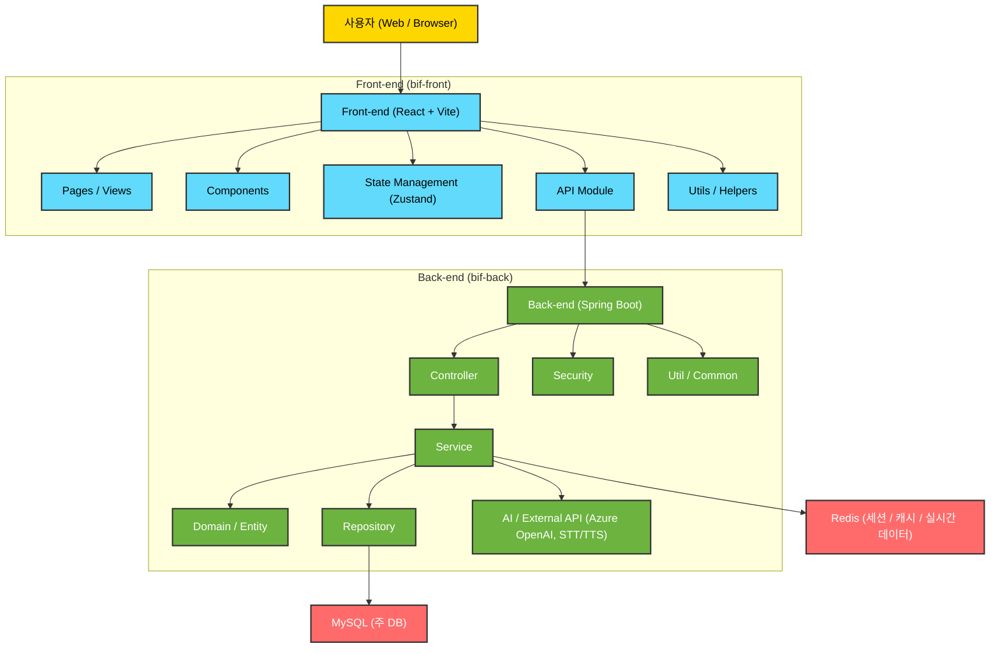
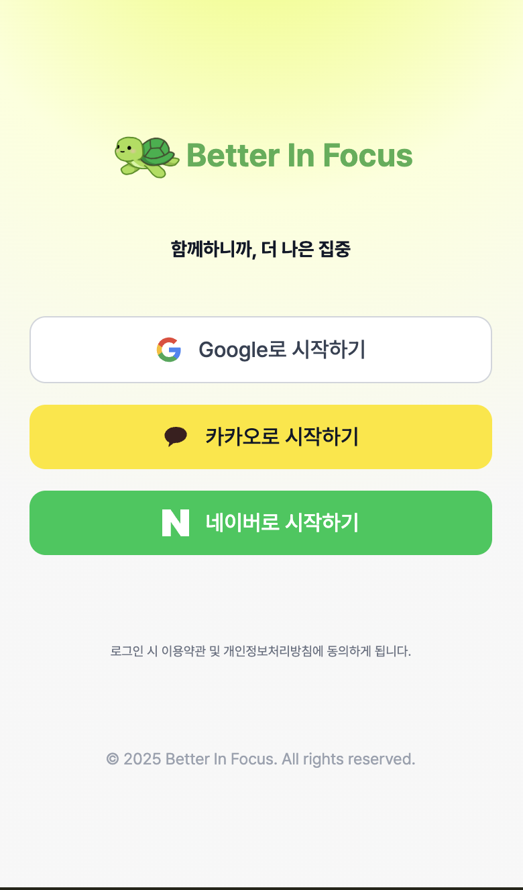
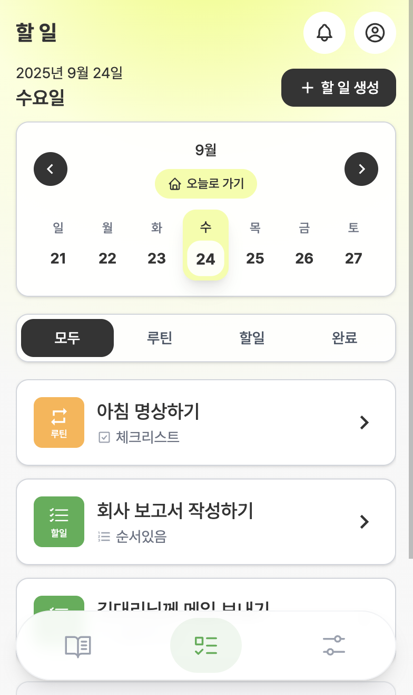
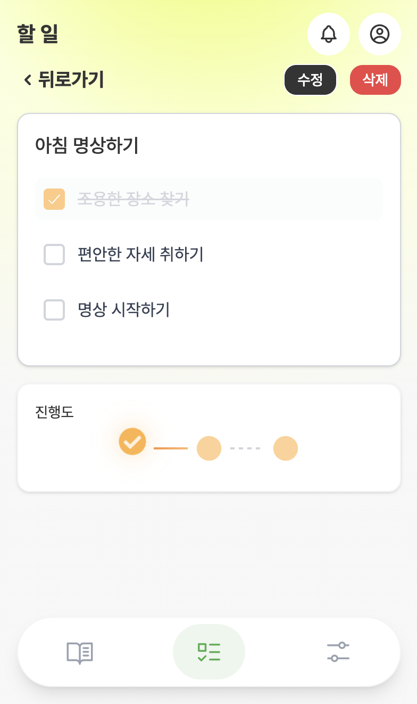
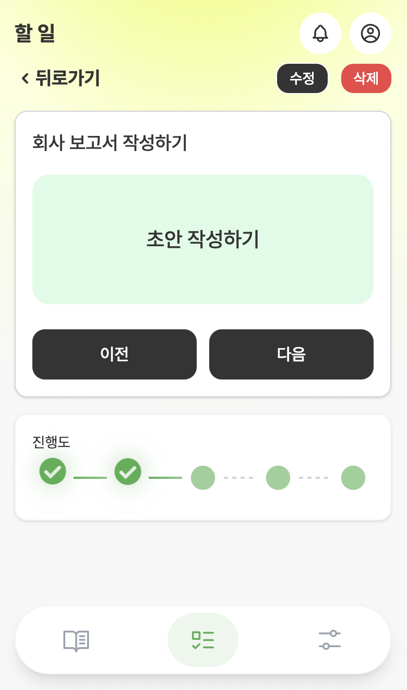
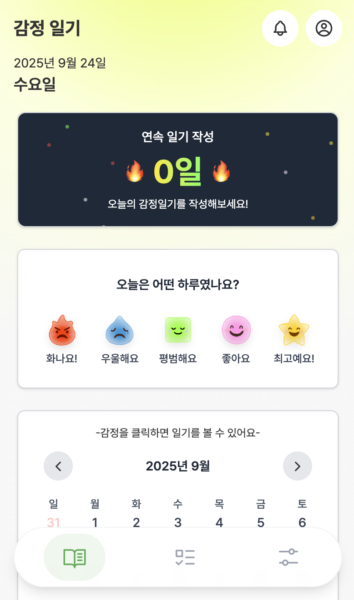

# 🤝 BIF (Better In Focus)

> AI 기반 경계선 지능인 자립 지원 서비스

<div align="center">


[🚀 Live Demo](https://ca-bif-frontend.purpleriver-2947c63e.koreacentral.azurecontainerapps.io) | [📚 API Docs](https://docs.google.com/spreadsheets/d/1tYVWuJSnXLTne6YwKYkm4hpgfGWWCIp1jFYymh0M0o0/edit?gid=1313629170#gid=1313629170) | [📖 ERD](https://www.erdcloud.com/d/H6bHQffYFFF2vGo74)

</div>

## 📋 목차

- [프로젝트 소개](#-프로젝트-소개)
- [핵심 기능](#-핵심-기능)
- [기술 스택](#-기술-스택)
- [시스템 아키텍처](#-시스템-아키텍처)
- [화면 구성](#-화면-구성-uiux)
- [API 명세](#-api-명세)
- [성능 최적화](#-성능-최적화)
- [설치 및 실행](#-설치-및-실행)
- [배포](#-배포)
- [문제 해결 과정](#-문제-해결-과정)
- [프로젝트 구조](#-프로젝트-구조)
- [기여 방법](#-기여-방법)

## 🎯 프로젝트 소개

### 배경

국내 697만 명(전체 국민의 14%)에 해당하는 경계선지능인(IQ 70-84)들은 지적장애로 분류되지 않아 기존 복지 및 교육 체계의 사각지대에 놓여 있습니다. 이들은 복잡한 정보 처리와 일반화 능력의 제한으로 업무 순서화, 지시 이해, 계획 수립에 어려움을 겪으며, 주의집중 부족으로 사회적 소통에도 어려움을 겪습니다. 반복적인 실패 경험으로 인한 낮은 자존감과 "손이 느리다"는 오해는 이들을 더욱 고립시키며, 불안정한 취업과 직업 유지의 어려움으로 사회적 자립에 큰 장벽을 만들고 있습니다.

### 목표

Better In Focus는 경계선지능인의 개인 역량 강화를 1차 목표로, 각자의 인지 수준에 맞춘 맞춤형 집중력 훈련을 통해 인지 능력을 향상시키고 단계별 성취 경험으로 자존감을 회복하도록 돕습니다. 2차 목표로는 시간 관리, 일정 관리 능력 개발과 업무 지시사항 이해 능력 향상을 통해 사회적 적응을 지원하며, 궁극적으로는 경계선지능인에 대한 사회적 편견 해소와 이들의 잠재력 발견을 통해 모든 사람이 자신만의 속도로 성장할 수 있는 포용적 사회 환경 조성을 목표로 합니다.

### 비전

"나만의 속도로 세상과 연결될 수 있도록" - Better In Focus는 경계선지능인들이 남들과 비교하지 않고 자신만의 속도로 학습하고 성장하여 사회의 당당한 구성원으로 자립할 수 있는 세상을 만들어갑니다. 단순한 기술적 솔루션을 넘어 경계선지능인들의 디지털 동반자가 되어, 개인의 고유한 특성을 존중하면서도 사회적 참여를 적극적으로 도모할 수 있는 맞춤형 지원 플랫폼으로 발전시켜 모든 사람이 자신의 가능성을 펼칠 수 있는 사회를 구현하고자 합니다.

### 성과 및 수상

🏆 **과학기술정보통신부·IITP 주최 우수성과 컨퍼런스 우수상** (2025.09)

## ✨ 핵심 기능

### 1. AI 기반 Todo 분해 시스템

- OpenAI GPT-4를 활용한 복잡한 업무 자동 세분화
- 날짜/시간, 반복 여부 감지
- 체계적인 생활 습관 형성을 통해 자립과 자기 효능감 향상

### 2. 실시간 알림 시스템

- Server-Sent Events (SSE)를 통해 클라이언트와 실시간 연결을 유지하여 앱 내에서 발생하는 이벤트를 즉시 전송
- Web Push API와 서비스 워커를 통해 브라우저 단에 메시지를 푸시하여, 앱이 비활성화 상태일 때도 스케줄링된 알림 전송

### 3. 감정 일기 분석

- AI 피드백 제공
- Speech-to-Text(STT) 지원
- Content Safety Check 적용 → 부적절한 내용은 차단 후 안전 응답 제공

### 4. 상황 시뮬레이션

- 업무 / 사회 / 일상 상황별 대화 시뮬레이션 제공
- TTS(Text-to-Speech) 지원 → 실제 대화처럼 연습
- 피드백과 모범 답안을 통해 반복 학습 가능

### 5. 통계 & 데이터 분석

- 작성된 감정 데이터를 캘린더/통계 차트로 시각화
- 보호자에게 월간 감정 비율, 키워드 TOP 5, 감정 변화 추이 제공
- AI 기반 월간 피드백 리포트 제공

## 🛠 기술 스택

### Backend


### Frontend


### Database & Cache


### Deployment & Cloud


### Collaboration & Tools


## 🏗 시스템 아키텍처



## 📺 화면 구성 (UI/UX)

## 📱 화면 구성 및 앱 흐름

<p align="center">
  
  
  
  
  
</p>

<p align="center">
<strong>화면별 간단 설명</strong>
</p>

<table>
<tr>
  <td><strong>로그인 화면</strong><br>사용자가 계정을 입력하고 앱에 로그인합니다.</td>
  <td><strong>할일 메인</strong><br>오늘의 할일 목록과 진행 상황을 확인하고 관리합니다.</td>
  <td><strong>할일 상세(체크리스트)</strong><br>체크리스트로 할일 목록을 보여줍니다.</td>
</tr>
<tr>
  <td><strong>할일 상세(순서 있음)</strong><br>순서있는 할일 목록을 보여 줍니다.</td>
  <td><strong>감정일기</strong><br>하루 감정을 기록하고 AI 피드백, 캘린더·통계를 확인합니다.</td>
  <td></td>
</tr>
</table>

## 📡 API 명세

### ✅ Todo API

| Method | Endpoint                | 설명           | 인증 필요 |
| ------ | ----------------------- | -------------- | --------- |
| GET    | `/todos`                | Todo 목록 조회 | ✅        |
| GET    | `/todos/{id}`           | Todo 상세 조회 | ✅        |
| POST   | `/todos`                | Todo 생성      | ✅        |
| PUT    | `/todos/{id}`           | Todo 수정      | ✅        |
| DELETE | `/todos/{id}`           | Todo 삭제      | ✅        |
| POST   | `/todos/{id}/decompose` | AI Todo 분해   | ✅        |

<details>
<summary>📝 Todo API 요청/응답 예시 보기</summary>

### Todo 생성 요청

```json
POST /todos
{
  "title": "병원 예약하기",
  "description": "이번 주에 치과 예약",
  "dueDate": "2024-12-25T10:00:00",
  "priority": "HIGH"
}
```

### Todo AI 분해 응답

```json
{
  "title": "간결한 제목 (최대 30자)",
  "type": "ROUTINE 또는 TASK",
  "has_order": true 또는 false,
  "sub_tasks": ["단계1", "단계2", "단계3"],
  "time": "HH:mm 또는 null",
  "date": "yyyy-MM-dd 또는 null",
  "repeat_frequency": "DAILY 또는 WEEKLY 또는 null",
  "repeat_days": ["요일들"] 또는 null
}
```

</details>
<br/>
※ 기타 API는 [Google Sheet API 명세서](https://docs.google.com/spreadsheets/d/1tYVWuJSnXLTne6YwKYkm4hpgfGWWCIp1jFYymh0M0o0/edit?gid=1313629170#gid=1313629170) 참고

## 🚀 설치 및 실행

### 1. 백엔드 (Spring Boot)

```bash
cd bif-back
./gradlew bootRun
```

### 2. 프론트엔드 (React)

```bash
cd bif-front
npm install
npm run dev
```

### 3. 환경 변수

- `.env` 파일 필요 (DB, JWT, OpenAI 등)
- 보안상 상세 내용은 생략
- 프로젝트를 클론한 후 .env를 설정하면 실행 가능

### 4. 웹앱 접속

- 브라우저에서 http://localhost:3000 접속

## ☁️ 배포 및 CI/CD

### 배포 환경

- **컨테이너 이미지**: Azure Container Registry (ACR)
- **배포 대상**: Azure Container Apps
- **백엔드/프론트 모두 컨테이너 이미지 사용**
  - 백엔드: Spring Boot 앱 컨테이너화 후 ACR에 푸시
  - 프론트: React 앱 빌드 후 컨테이너화하여 ACR에 푸시
- **자동 실행**: Azure Container Apps에서 이미지 Pull 후 컨테이너 실행

### CI/CD

- **GitHub Actions** 사용
  - main 브랜치로 `push` 발생 시 워크플로우 실행
  - 백엔드/프론트 코드 빌드 후 컨테이너 이미지 생성
  - ACR에 이미지 푸시
  - Azure Container Apps에 최신 이미지 자동 배포

## 📝 학습 및 문제 해결 경험

### AI 기술 학습

- Todo 관리 기능 개발을 통해 프롬프트 엔지니어링 핵심 원리 습득
- 자연어 요청뿐 아니라 명확한 출력 형식 정의, 분류 기준 명시, 예외 처리 포함
- Temperature 조정, 토큰 제한, 검증 로직 적용으로 AI 불확실성 제어 및 안정적 결과 확보

### 기술적 학습

- 풀스택 개발 경험: Spring Boot 백엔드 ↔ React 프론트엔드 연동
- 주요 기술 적용: RESTful API 설계, JWT 인증 시스템, JPA 기반 데이터 관리
- 품질 관리 경험: SonarLint, ESLint 활용으로 코드 품질과 안정성 향상

### 협업과 소통

- GitHub 기반 형상관리 및 코드 리뷰 경험
- 특수 사용자층(경계선 지능인) 고려한 UX 설계 과정에서 팀 내 의견 조율 및 사용자 관점 사고 경험
- 실무 프로젝트에서 협업과 커뮤니케이션의 중요성 체감

## 👥 팀원 소개

| 이름    | 담당 및 주요 역할                                                                            |
| ------- | -------------------------------------------------------------------------------------------- |
| 장 민호 | GitHub Projects/Issues 관리, Todo 기능 (BE/FE), Azure 배포 서버 환경 구축                    |
| 유 동기 | 전역 에러 코드 및 메시지 정책, 마이 페이지·감정 일기 통계 (BE/FE), Azure 배포 서버 환경 구축 |
| 노 종현 | 시뮬레이션 (BE/FE), 회의록 작성                                                              |
| 오 영화 | 소셜 로그인 및 인증/인가 설정, Azure 배포 서버 환경 구축, Figma 디자인                       |
| 김 소영 | 서비스 기획 및 발표, 감정 일기 (BE/FE), UI/UX 설계 및 Figma 디자인                           |
